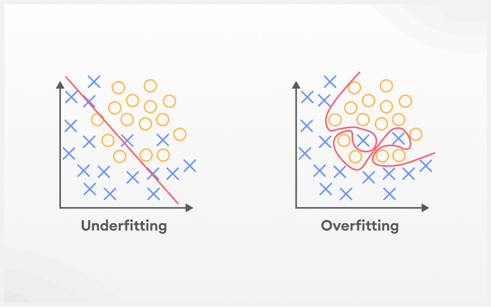

# Overfitting and Underfitting

Overfitting: Good performance on the training data, poor generliazation to other data. 

Underfitting: Poor performance on the training data and poor generalization to other data.

There are regularisation techniques to handle overfitting. The parameters adjustments in the model can also help by defining a less fine detail for each respective algorithm.

Random Forest Classifier:
- n_estimators: This parameter controls the number of decision trees in the forest. Increasing the number of trees can lead to a more complex model that may overfit the data. Reducing n_estimators can simplify the model and prevent overfitting.

- max_depth: Specifies the maximum depth of the decision trees in the forest. Limiting the depth of the trees can prevent them from learning intricate patterns in the data, thus reducing overfitting.

- min_samples_split: This parameter defines the minimum number of samples required to split an internal node. Increasing min_samples_split can prevent the model from splitting nodes too finely, leading to a less complex model.

Support Vector Machine (SVM):
- C parameter: In SVM, C is the regularization parameter that controls the trade-off between maximizing the margin and minimizing the classification error. A smaller C value imposes a stronger regularization, which can prevent overfitting by limiting the influence of individual data points on the decision boundary.

- Kernel parameters (gamma): If you're using non-linear SVM with kernels like radial basis function (RBF), adjusting the gamma parameter can control the smoothness of the decision boundary. A smaller gamma value leads to a smoother decision boundary, which can help prevent overfitting by avoiding overly complex decision boundaries.