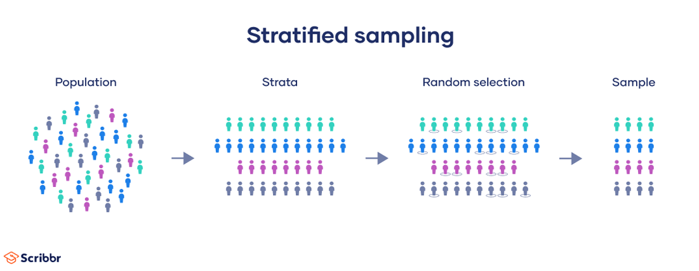

# Sampling 

The following chapters references questions from {cite}`simplilearn`.

There are various types of Sampling an examples of sampling and use cases are shown below:

## Simple random sampling

A simple random sample is a randomly selected subset of a population. In this sampling method, each member of the population has an exactly equal chance of being selected.

```{note}
However, simple random sampling can be challenging to implement in practice. To use this method, there are some prerequisites:

- You have a complete list of every member of the population.
- You can contact or access each member of the population if they are selected.
- You have the time and resources to collect data from the necessary sample size.
```

Simple random sampling works best if you have a lot of time and resources to conduct your study, or if you are studying a limited population that can easily be sampled.

## Systematic sampling

Systematic sampling is a probability sampling method in which researchers select members of the population at a regular interval (or k) determined in advance.

```{note}
Order of the population
When using systematic sampling with a population list, it’s essential to consider the order in which your population is listed to ensure that your sample is valid.

You should not use systematic sampling if your population is ordered cyclically or periodically, as your resulting sample cannot be guaranteed to be representative.
```

## Cluster sampling

In cluster sampling, researchers divide a population into smaller groups known as clusters. They then randomly select among these clusters to form a sample.

Steps to cluster:


Advantages
- Cluster sampling is time- and cost-efficient, especially for samples that are widely geographically spread and would be difficult to properly sample otherwise.
- Because cluster sampling uses randomization, if the population is clustered properly, your study will have high external validity because your sample will reflect the characteristics of the larger population.

Disadvantages
- Internal validity is less strong than with simple random sampling, particularly as you use more stages of clustering.
- If your clusters are not a good mini-representation of the population as a whole, then it is more difficult to rely upon your sample to provide valid results, and is very likely to be biased.
- Cluster sampling is much more complex to plan than other forms of sampling.


## Stratified sampling

In a stratified sample, researchers divide a population into homogeneous subpopulations called strata (the plural of stratum) based on specific characteristics (e.g., race, gender identity, location, etc.). Every member of the population studied should be in exactly one stratum.

Each stratum is then sampled using another probability sampling method, such as cluster sampling or simple random sampling, allowing researchers to estimate statistical measures for each sub-population.

Researchers rely on stratified sampling when a population’s characteristics are diverse and they want to ensure that every characteristic is properly represented in the sample. This helps with the generalizability and validity of the study, as well as avoiding research biases like undercoverage bias.




## References

Explanations were retrieved from {cite}`sampling_explanation_scibbr`

```{bibliography}
```
