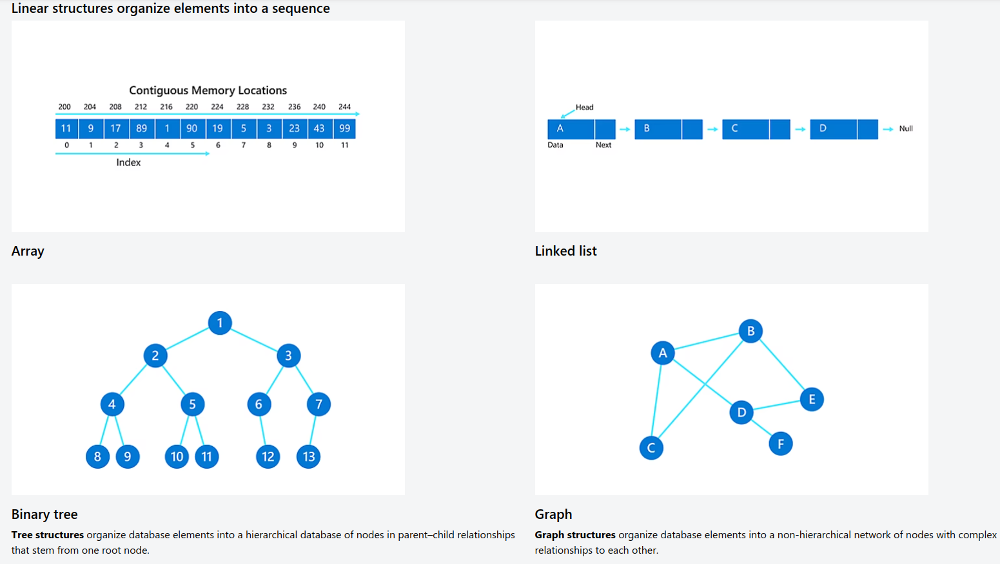
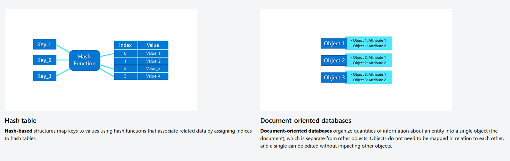

# Types of Data Storage

## Types of Database

__Relational.__ This tabular approach defines data so it can be reorganized and accessed in many ways. Relational databases are comprised of tables. Data is placed into predefined categories in those tables. Each table has columns with at least one data category, and rows that have a certain data instance for the categories which are defined in the columns. Information in a relational database about a specific customer is organized into rows, columns and tables. These are indexed to make it easier to search using SQL or NoSQL queries.

Relational databases use SQL in their user and application program interfaces. A new data category can easily be added to a relational database without having to change the existing applications. A relational database management system (RDBMS) is used to store, manage, query and retrieve data in a relational database.

Typically, the RDBMS gives users the ability to control read/write access, specify report generation and analyze use. Some databases offer atomicity, consistency, isolation and durability, or ACID, compliance to guarantee that data is consistent and that transactions are complete.

__Distributed.__ This database stores records or files in several physical locations. Data processing is also spread out and replicated across different parts of the network.

Distributed databases can be homogeneous, where all physical locations have the same underlying hardware and run the same operating systems and database applications. They can also be heterogeneous. In those cases, the hardware, OS and database applications can be different in the various locations.

__Cloud.__ These databases are built in a public, private or hybrid cloud for a virtualized environment. Users are charged based on how much storage and bandwidth they use. They also get scalability on demand and high availability. These databases can work with applications deployed as software as a service.

__NoSQL.__ NoSQL databases are good when dealing with large collections of distributed data. They can address big data performance issues better than relational databases. They also do well analyzing large unstructured data sets and data on virtual servers in the cloud. These databases can also be called non-relational databases.

__Object-oriented.__ These databases hold data created using object-oriented programming languages. They focus on organizing objects rather than actions and data rather than logic. For instance, an image data record would be a data object, rather than an alphanumeric value.

__Graph.__ These databases are a type of NoSQL database. They store, map and query relationships using concepts from graph theory. Graph databases are made up of nodes and edges. Nodes are entities and connect the nodes.

These databases are often used to analyze interconnections. Graph databases are often used to analyze data about customers as they interact with a business on webpages and in social media.

Graph databases use SPARQL, a declarative programming language and protocol, for analytics. SPARQL can perform all the analytics that SQL can perform, and can also be used for semantic analysis, or the examination of relationships. This makes it useful for performing analytics on data sets that have both structured and unstructured data. SPARQL lets users perform analytics on information stored in a relational database, as well as friend-of-a-friend relationships, PageRank and shortest path.

## Databases use, examples and considerations

A database is a structured collection of data stored on a computer system.
It's like a digital version of a filing cabinet, organizing and storing information for easy access and management.

__Uses of Databases:__

Databases are used to store, organize, and manage data efficiently.
They are essential for various purposes like tracking financial transactions, managing e-commerce catalogs, powering social networks, and providing personalized recommendations.

__Relational Databases:__ Organize data into tables with rows and columns.

Examples: SQL Server, MySQL, PostgreSQL.
Non-Relational Databases (NoSQL): Store unstructured or semi-structured data.

Examples: MongoDB, Cassandra, Redis.
In-Memory Databases: Store data in computer's memory for faster access.

Commonly used for caching frequently accessed information.

__Common Database Structures:__

Relational databases use tables, while non-relational databases employ various structures like arrays, linked lists, binary trees, graphs, hash tables, and document-oriented databases.

__Examples of Database Usage:__

Financial Transactions: Banks use databases to track customer transactions.

E-commerce Catalogs: Online stores use databases to manage product catalogs.

Social Networks: Social media platforms use databases to store user information and relationships.

Personalized Results: Websites use databases to provide personalized recommendations.

Business Analytics: Organizations use databases to analyze large volumes of data for insights.

__Database Management Systems (DBMS):__

DBMS are software tools used to control and manage databases.
They help in organizing, accessing, and securing data across multiple applications or locations.

__Factors in Choosing a DBMS:__

On-Premises vs. Cloud: Decide where your data will be stored—on private servers or in the cloud.

Centralized vs. Distributed vs. Federated Architecture: Choose how your data will be stored—centrally in one system, across multiple systems, or unified from various sources.

Scaling Up vs. Scaling Out: Decide whether to add resources to existing servers (vertical scaling) or add more servers (horizontal scaling) to accommodate data growth.

